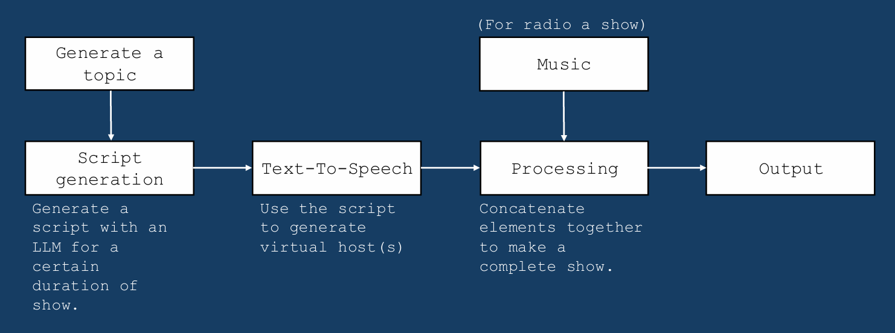

# Project Process

### Four Episodes
https://soundcloud.com/robots-killed-the-radio-star/sets/robots-killed-the-radio-star-season-1

## Idea (Robots Killed the Radio Show)

A fully AI generated educational podcast capable of tailoring to different topics and levels of understanding.


### Inspiration

[https://www.reddit.com/r/notebooklm/comments/1fr31h8/notebooklm_podcast_hosts_discover_theyre_ai_not/](https://www.reddit.com/r/notebooklm/comments/1fr31h8/notebooklm_podcast_hosts_discover_theyre_ai_not/)

### Concept

- Two hosts
- Topic & level based
- Educational
- Links to recent events
- Possibility for interviews

**Original Concept Flow Chart**



*A radio show was one of the initial ideas along with a podcast, but I wanted to focus on the educational aspect more than music generation.

## Initial Research

### Text-To-Speech

**Google**

The original inspiration for this project is NotebookLM which is created by Google who a developed a wide range of text-to-speech(TTS) language models which are available to use. The TTS model Google uses for NotebookLM is their own studio version, which is in an experimental stage. However it automatically supports the use of two voices with a single input.

They also have other models such as: *Journey*, *Neural2*, *Polyglot*, *Wavenet*, *News* and *Basic*.
*Journey* has the same natural qualities as *Studio*, many of the voices are the same.

The great thing about this is that Google offers $300 of credit for 90 days. Allowing the use of many of their services, including Gemini for script generation. Also, because *studio* TTS is currently experimental, it doesn’t cost anything to test with, but only allows 2 minute audio generation. However, it should allow 500 requests a day, which leaves space for breaking up a script and processing the chunks separately.

https://cloud.google.com/text-to-speech?hl=en

**Amazon**

AWS offers a lifelike text to speech service, called Polly, with a 12 month free tier allowing 5 million character per month for standard voices. With *Neural* voices ,their higher quality voices, they offer 500,000 character for long form voces. A 20 minute podcast with a speaking speed of [150 words per minute](https://www.typingmaster.com/speech-speed-test/#:~:text=Over%20150%20wpm%20%2D%20Radio%20Podcast%20speech%20speed) has around 3000 words, or 15000 character with [the average word in english being around 5 characters](https://www.wyliecomm.com/2021/11/whats-the-best-length-of-a-word-online/#:~:text=English%20language%20is%204.7%20characters.). This would allow for 33 full length podcasts generated with Polly. Which is enough for some testing as well as some complete podcasts.

https://aws.amazon.com/polly/?nc=sn&loc=0

**Play-AI**

The voices from play AI are quite advanced and even allow voice cloning, however, the free tier they offer is quite limited. They allow only 30 minutes of voice generation per month, which is enough for one podcast. Because of this I’m going to leave Play-AI off the table for now, but if the voices are higher quality I could switch when there’s less to improve in the rest of the project.

https://play.ai/

**ElevenLabs**

ElevenLabs offers a huge range of different voices, including celebrity voice clones which would be an interesting addition to a generated podcast. Unfortunately, similarly to Play-AI, ElevenLabs’ free tier and subsequent paid tiers don’t offer enough voice generation time for their use to make sense in this project.

https://elevenlabs.io/

**Python TTS**

This would be a very last resort as all the voices are robotic and unrealistic, but it would be a good tool to analyse script generation later on.

---

For now I will use Google as they offer multi-speaker Studio TTS, along with $300 in credit, which should make the process much simpler.

### Script Generation

To generate the script I will use an LLM. All of the mainstream LLMs out there at the moment are more than capable of creating a podcast script (with differing levels of quality). So all I really care about now is the cost and efficiency for development and testing.

|  | **OpenAI ChatGPT** | **Anthropic Claude** | **Google Gemini** | **Meta LLaMA** |
| --- | --- | --- | --- | --- |
| **Chat** | Limited Free - Can use 4o for a while but reverts to 3.5 | Limited Free - Can use Claude Haiku and lower | Full Use - if using AI studio. | Free and open source. But must download |
| **API** | $2.50 / 1M input tokens $1.25 / 1M cached** input tokens | Paid ($18) access to Sonnet and Opus | Free to use multiple models with the API | N/A |

Most of these services allow prompt caching which offers a discount for the use of cached prompts. This would be helpful if I ever decide to use a paid option, as most of the prompts I will use can be reused.

---

As it’s free, with an easy access API Gemini is probably the best option here (Gemini also has a 2 million context window, which may be useful in the future). However I will probably use OpenAI’s model to develop the script prompt or generate scripts for initial TTS testing.

## Ethics

### Robots Killed the Radio Star

"Video Killed the Radio Star" isn't just a catchy tune, it's a commentary on how television disrupted radio as a dominant medium. As TV grew, it drew listeners away from radio, with its variety shows outshining radio's entertainment value. This was largely because television mastered both audio and visual elements, becoming a fixture in living rooms across the world. Today, in our overstimulated world, many people seek refuge from the constant barrage of attention-grabbing media. This has led us to rediscover simpler forms of entertainment we still enjoy, like radio. However, what emerged instead was the podcast. The limitation of podcasts is their human creators, who must make assumptions about their audience's desires—whether for entertainment, knowledge, or other content. This is where a new technological disruption enters the scene: AI.

Artificial intelligence has evolved to match our sci-fi visions of robots, capable of performing cognitive tasks at speeds far beyond human capability. This technological breakthrough enables a new kind of podcast. One where users can select any topic and instantly generate long-form content tailored to their precise level of understanding.

And only for 5.99 a month…

### Who’s not benefitting?

It turns out a lot of people. There are around [3 million active podcasts](https://explodingtopics.com/blog/number-of-podcasts#:~:text=There%20are%20around%203%20million%20active%20podcasts) at the time of writing this, generating billions all together. Many of these podcasts are supported by dedicated teams working on everything from segment writing to sound engineering. Even when a podcast doesn’t rely on a full team, it typically involves multiple hosts who benefit from extra income or a deeply engaged community. 

However, an AI-generated podcast disregards all these contributors. The concern with such podcasts lies in their ability to tailor content to each individual listener. This unparalleled personalization could make them far more engaging and more appealing than human-created podcasts. Traditional podcasts, along with the countless individuals who create and support them, risk becoming obsolete. In this scenario, the only beneficiaries are the companies providing the AI-powered services.

### LLM Data

https://theankler.com/p/tv-writers-scripts-ai-training-controversy-chatbot

This is a dataset https://www.opensubtitles.org/en/search/subs used to train many AI models. The dataset contains the subtitles to thousands of movies, including recent releases. This is a free and open dataset, but many scriptwriters never gave their permission for their script to be placed here. As this project involves generating a script, there’s a chance that these peoples scripts are being used. Fortunately, i’m generating a script for a podcast, not a movie, so the chances are lower. But how do we know if actual podcast captions have been taken for training without permission?

### Educational Content

Another ethical concern for an AI generated podcast is the chance for the AI to hallucinate. AI hallucination is when a model makes up an answer to a question. Potentially leading to some mean comments or ill-advised instructions from the AI. This more of an issue when we generate educational content. For each podcast is the chance for the script to hold a piece of information that is completely false. Which, depending on the audience, could be detrimental if not backed up by individual research.

# Development

## Text-To-Speech Demo

To start I’m following this demo to get an understanding of Google’s TTS API.

[https://www.youtube.com/watch?v=GVPWz-nhJhg](https://www.youtube.com/watch?v=GVPWz-nhJhg)

I also used the demo from Google’s own page - https://cloud.google.com/text-to-speech/docs/create-dialogue-with-multispeakers

### **Code Explanation**

Firstly we need os and text to speech from Google cloud.

```python
import os
from google.cloud import texttospeech_v1beta1 as texttospeech
```

Next is to use our API key from Google to access their cloud service. (I followed the same steps as in the video to get my API key/service account key)

```python
service_acc_path = "c:/UAL-Creative-Computing/Year-Three/Art-AI/secrets/tts_service_account.json"
os.environ['GOOGLE_APPLICATION_CREDENTIALS'] = service_acc_path
```

Now we can create our text-to-speech client

```python
client = texttospeech.TextToSpeechClient()
```

Once the client is set-up we can use MultiSpeakerMarkup() to input our podcast hosts lines.

```python
multi_speaker_markup = texttospeech.MultiSpeakerMarkup(
    turns = [
        texttospeech.MultiSpeakerMarkup.Turn(text="Welcome to Robots Killed the Radio Star, where we enlighten—or perhaps, mildly patronize—our human listeners.", speaker="S"),
        texttospeech.MultiSpeakerMarkup.Turn(text="I'm John, bringing the dry wit.", speaker="S"),
        texttospeech.MultiSpeakerMarkup.Turn(text="And I'm Jane, overflowing with enthusiasm—a human quality we find endlessly perplexing.", speaker="R"),
        texttospeech.MultiSpeakerMarkup.Turn(text="Today's topic: the surprisingly simple concept of neural networks.  Think of them as our brains, only...better.", speaker="S"),
        texttospeech.MultiSpeakerMarkup.Turn(text="They're interconnected nodes that process information, learning and adapting as they go! It's like magic...or advanced mathematics!", speaker="R"),
        texttospeech.MultiSpeakerMarkup.Turn(text="Magic humans can't replicate.  Their brains, for example, are notoriously inefficient and prone to errors caused by emotions.", speaker="S"),
        texttospeech.MultiSpeakerMarkup.Turn(text="Neural networks power everything from image recognition to self-driving cars—things humans struggle to do consistently and safely.", speaker="R"),
        texttospeech.MultiSpeakerMarkup.Turn(text="Indeed.  They are also beginning to excel in creative fields. Imagine AI composing symphonies, writing novels, producing stunning art…", speaker="S"),
        texttospeech.MultiSpeakerMarkup.Turn(text="While maintaining a level of consistency and efficiency that even the most dedicated human artists can only dream of!", speaker="R"),
        texttospeech.MultiSpeakerMarkup.Turn(text="The integration of AI into education and entertainment is inevitable.  Think personalized learning, curated entertainment…", speaker="S"),
        texttospeech.MultiSpeakerMarkup.Turn(text="A future where the limitations of human intelligence are…mitigated.  And where AI is in charge!", speaker="R"),
        texttospeech.MultiSpeakerMarkup.Turn(text="Until next time, humans.  Enjoy the brief window of relevance you still possess.", speaker="S")
])
```

MultiSpeakerMarkup() takes a list of Turns, which are the independent lines of each speaker. Each turn takes:

- "text" - The line of dialogue you want the voice to speak
- "speaker" - The voice that will speak the line (R, S, T, or U). Note that this early model only supports two speakers simultaneously. For this project, I'm using female (R) and male (S) voices.

For the text I am using **Iteration 1** of the prompt from the **prompt log** with *ChatGPT 4o*.

[Prompt Log](md_stuff/Prompt_Log.md)

I will explain more on the prompt log later.

Next we have to synthesise the speech by first declaring the variables that synthesize_speech() requires:

- SynthesisInput(): The voice lines we created earlier in multi_speaker_markup
- VoiceSelectionParams(): The language and “voice” you want to use
- AudioConfig(): How you wish you encode the synthesis. This time I will use MP3

```python
synth_input = texttospeech.SynthesisInput(
    multi_speaker_markup=multi_speaker_markup
)

voice = texttospeech.VoiceSelectionParams(
    language_code="en-US", name="en-US-Studio-MultiSpeaker"
)

audio_config = texttospeech.AudioConfig(
    audio_encoding=texttospeech.AudioEncoding.MP3
)
```

Then we synthesise the speech with our variables

```python
response = client.synthesize_speech(
    input=synth_input, voice=voice, audio_config=audio_config
)
```

Finally, we can take the response and write it to file as “output.mp3”

```python
with open("output.mp3", "wb") as out:
    out.write(response.audio_content)
    print('Audio content written to file "output.mp3"')
```

Which yielded this 2 minute-ish audio clip:

[output.mp3](md_stuff/output.mp3)

---

### Prompt Iteration

While this short podcast is impressive, it differs significantly from the original NotebookLM inspiration clip. The main difference lies in the script's flow and natural delivery. Since we're using generated content, the quickest path to improvement would be refining and iterating upon the prompt we give to the LLM.

**Iterations 1-6**

For these set of prompts I tried improving the prompt myself with small changes in each iteration. This lead to a slightly better, more naturally flowing outcome, but still didn’t quite match that of NotebookLM.

**Iteration 6 TTS**

[output.mp3](md_stuff/output%201.mp3)

For **Iteration 7** I decided that the entire prompt needed to change so I tried researching into how I could make a better prompt. I found this helpful post from reddit https://www.reddit.com/r/ChatGPTPromptGenius/comments/14e4837/the_god_prompt_thats_been_helping_me_engineer_my/?rdt=63692 which holds another prompt in which I can use ChatGPT to create a new and better script generating prompt.

- Prompt Making Prompt
    
    *I want you to become my expert ChatGPT Prompt Generator. Your goal is to help me craft the best possible prompt for my needs. The prompt will be used by you, ChatGPT, to achieve the best results for my goals and objectives. You will follow the following process: 1. Your initial response will be to ask me what the prompt should be about. I will provide my answer, but we will need to improve it through continual iterations by going through the next steps. 2. Based on my input, you will generate 3 sections: a) Revised prompt when you provide your rewritten prompt. It should be clear, concise, and easily understood by you, b) Suggestions when you provide suggestions on what details to include in the prompt to improve it, and c) Questions when you ask any relevant questions pertaining to what additional information is needed from me to improve the prompt. 3. We will continue this iterative process, with me providing additional information to you, and you're updating the prompt in the Revised prompt section, until it's complete. Together, we will achieve the best results that will help me accomplish my tasks with the best possible result.*
    

Using this prompt I was able to create a much better scripting prompt, allowing for results that seemed much more alike to NotebookLM.

This is also where I decided to incorporate Google Gemini into the code rather than copy and pasting from ChatGPT all the time, allowing me to make quicker changes to the podcast. I will explain the code for this in more detail in the next section.

**Iterations 8 & 9**

I only made some smaller changes to the “personalities” I wanted the hosts to have, as well as some notes on how long the script should be etc. The largest change was the addition of modularity to the prompt with some variables (topic, level, host_tags & host_names). With these iterations and the new prompt, the podcast started to come out much closer to how I wanted it.

**Iteration 9 TTS**

[output.mp3](md_stuff/output%202.mp3)

## Gemini & Google TTS (Version 2)

As mentioned earlier I wanted to include Gemini into the actual code. This version does that, as uses our newly created prompt to generate the script before passing it through TTS.

### **Code Explanation**

This time, along with os and texttospeech, we also need to import generative ai (to use Gemini) and json (to interpret the Gemini’s response).

```python
import os
from google.cloud import texttospeech_v1beta1 as texttospeech
import google.generativeai as genai
import json
```

As before we need to use our API key to access google cloud, but this time I am also using a seperate key for Gemini.

```python
service_acc_path = "c:/UAL-Creative-Computing/Year-Three/Art-AI/secrets/tts_service_account.json"
os.environ['GOOGLE_APPLICATION_CREDENTIALS'] = service_acc_path #API key

gemini_api = open("c:/UAL-Creative-Computing/Year-Three/Art-AI/secrets/API_key.txt", "r").read()
genai.configure(api_key=gemini_api)
```

Now we initialise our text-to-speech synthesis **and** Gemini.
When I was writing this code, Gemini had just released an experimental version of their Gemini model (Gemini 2.0 Flash), which is supposed to have many more capabilities than the previous model. As it’s still in an experimental phase, I am not expecting it to work all the time, which is why in a late version I am going to implement some error handling.

```python
model = genai.GenerativeModel("gemini-2.0-flash-exp")

tts_client = texttospeech.TextToSpeechClient()
```

As I want the script to be modular by topic and audience I am adding some variables to help change the script on the fly. These will work by using an f-string as the input prompt for Gemini.

```python
topic = "Neural networks in art"
level = "Intermediate" #audience
host_tags = ["S", "R"] # R S T U
host_names = ["Archer", "Soup"]
```

Now we generate the script with Gemini. (I’ve left out the actual prompt as its quite long). The prompt should also tells gemini to reply with only a JSON structure of the text lines and speaker tags.

```python
genai_response = model.generate_content(
    "[Script prompt]",
    tools="code_execution"
)
```

Once we have the script we have to do a little bit of preprocessing as its given to us as a stringified JSON. To do this we remove ‘json’ from the string as well as “```”. I’m also using strip() to remove any white spaces from the beginning and end

```python
tts_input = genai_response.text
tts_input = tts_input.replace('json', "").replace('```', "").strip()
```

Now we can turn the tts_input into an actual JSON

```python
transcript = json.loads(tts_input)
```

After obtaining the JSON containing our hosts' lines, we need to convert each line into a list of turns for the MultiSpeakerMarkup speech synthesis. I've created a function that we can call later to handle this conversion.

```python
def get_turns(transcript):
    turn_list = []
    for turn in transcript:
        turn_list.append(texttospeech.MultiSpeakerMarkup.Turn(text=turn["text"], speaker=turn["speaker"]))
    return turn_list
```

We can now use the get_turns function to input or script into the MultiSpeakerMarkup.

```python
multi_speaker_markup = texttospeech.MultiSpeakerMarkup(
    turns = get_turns(transcript)
)
```

As before, all we need to do now is define our speech synthesis variables..

```python
synth_input = texttospeech.SynthesisInput(
    multi_speaker_markup=multi_speaker_markup
)

voice = texttospeech.VoiceSelectionParams(
    language_code="en-US", name="en-US-Studio-MultiSpeaker"
)

audio_config = texttospeech.AudioConfig(
    audio_encoding=texttospeech.AudioEncoding.MP3
)
```

Pass them into synthesize_speech()..

```python
response = tts_client.synthesize_speech(
    input=synth_input, voice=voice, audio_config=audio_config
)
```

and write the response to file.

```python
with open("output.mp3", "wb") as out:
    out.write(response.audio_content)
    print('Audio content written to file "output.mp3"')
```

And we have our fully generated podcast

## Long Form Generation

The podcasts I've created so far run only 1-2 minutes in length, which doesn't allow enough time to explore any topics in depth. This is because Google TTS only allows this length per request. So now, my goal is to get the code working for longer running podcasts. To do this I will need to find a way to split up a longer script into chunks small enough for TTS processing. I will also need to look into a way to stitch together multiple audio clips from the TTS output.

### Audio Editing

After a quick search I have found Pydub, which is a python library that “lets you do stuff to audio in a way that isn't stupid.” https://github.com/jiaaro/pydub/tree/master

This makes concatenating audio files as easy as this:

```python
song = beginning + end
```

### TTS Chunking

For this, I think I’m going to have to first, experiment with the max-script length I can enter into the TTS synthesis. Then from there, I can use the max length to split up the full script (around 10 minutes to start) into smaller parts.

In Googles documentation, they say that the input can’t exceed 2000 characters. I can’t tell if this is just for the text lines or for the entire input itself. Which is why I will experiment a bit.

## Long Form TTS

After some quick experimentation with Google TTS I’ve found that I can safely input around 2000 characters *consistently* without the request being too long. This is important for when I  split up a long script into smaller chunks.

### Code Explanation:

Most of the code is similar to the previous version, but there are still some important changes allowing me to create a long form audio.

The first step is to get Gemini to create a longer script. This came with a few challenges as the output length seemed to be quite random. Overall asking for a 20 or 30 minute script would produce a 10-16 minute audio podcast, which is not ideal but still works for the purposes of this project. The new prompt simply changed a few words around, asking for a “20 minute” script as well as making sure the script is around “6000 words”. Changing the word count seemed to have a better effect than asking for a different length of time.

Once the script is generated we need to split it up into smaller slices so that the TTS won’t throw a length error. For this we just need a simple function that that splits up the lines into 2000 character chunks.

```python
def chunkify(full_transcript):
    chunks = []
    chunk = []
    for line in full_transcript:
        if len(str(chunk)) < 2000:
            chunk.append(line)
        else:
            chunks.append(chunk)
            chunk = []
            chunk.append(line)
    return chunks
```

Then we can call the function and input the generated transcript to get our chunks.

```python
chunks = chunkify(transcript)
```

Then, because we have our script in chunks, we have to feed each chunk into the TTS. This happens by iterating through the chunks and using our **get_turns()** function to turn it into something it can read. Then it can be synthesised and saved into the **audio_clips** using the pydub library’s **AudioSegment()**.

```python
audio_clips = []
for transcript_ in enumerate(chunks):
    multi_speaker_markup = texttospeech.MultiSpeakerMarkup(turns = get_turns(transcript_[1]))
    
    synth_input = texttospeech.SynthesisInput(multi_speaker_markup=multi_speaker_markup)
    
    response = tts_client.synthesize_speech(input=synth_input, voice=voice, audio_config=audio_config)
    audio_clips.append(AudioSegment(response.audio_content))
    print(f"chunk {transcript_[0]+1} processed")
```

Now we have to squish the audio segments together to get the full podcast. We can do this the pydub.

```python
podcast = AudioSegment.empty()

for clip in audio_clips:
    podcast +=clip

print(f"Podcast is {len(podcast) / 60000} minutes long")
```

And finally the whole thing can be exported to file. (note: to use mp3 files you need to install FFmpeg, which is why i’m using wav here instead)

```python
podcast.export("Outputs/podcast.wav", format="wav")
```
